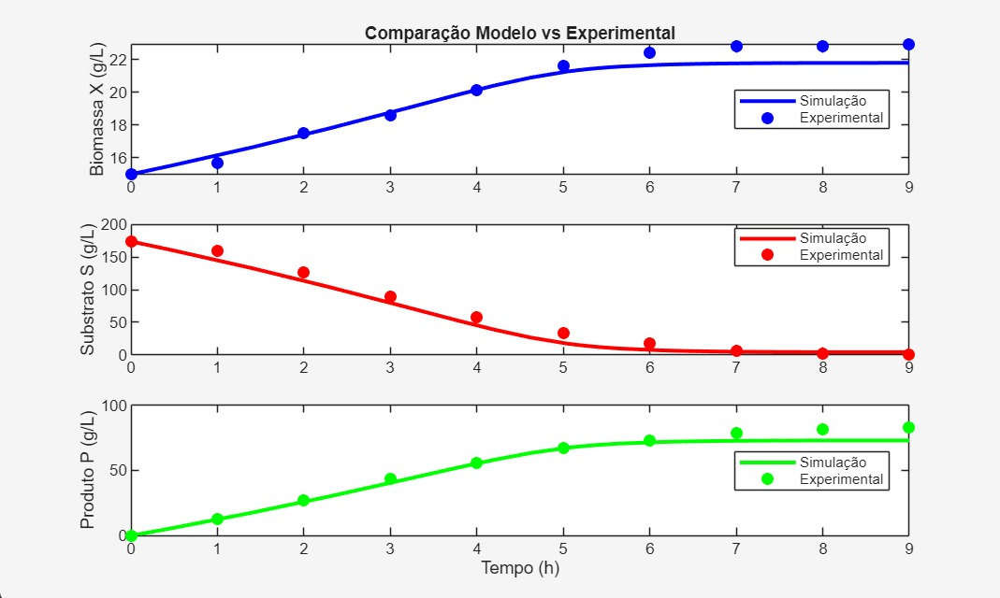
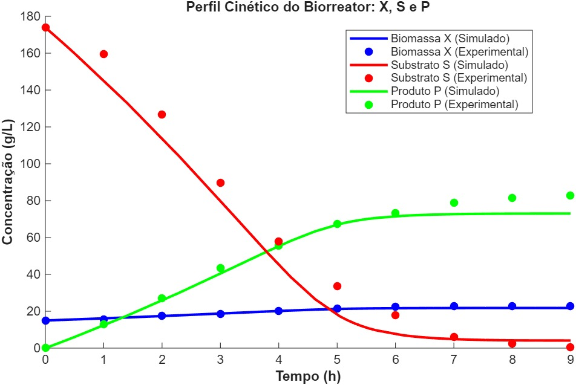

Esse repositório tem como objetivo a modelagem matemática de um biorreator em batelada, obdecendo a cinética Andrews / Lee-Pirt-Coulman / Levenspiel.

O código principal está disponível no [main.m](/main.m).
As funções auxiliares estão disponíveis nos demais arquivos, como:
* [Celulas.m](celulas.m)
* [Substrato.m](substrato.m)
* [produto.m](produto.m)

# MODELAGEM DE BIORREATOR EM BATELADA
## Cinética de Andrews / Lee-Pirt-Coulman / Levenspiel (13)

Os balanços de massa para biomassa ($X$), substrato ($S$) e produto ($P$) assumindo taxa de morte insignificante e sem consumo para manutenção, são descritos pelas seguintes Equações Diferenciais Ordinárias (EDOs):

$$\frac{dX}{dt}=\mu X$$

$$\frac{dS}{dt}=-\frac{\mu X}{Y_{X/S}}$$

$$\frac{dP}{dt}=Y_{P/S}\left(\frac{\mu X}{Y_{X/S}}\right)$$

### Modelo Cinético

O modelo de crescimento escolhido contabiliza a inibição por substrato (Andrews) e a inibição por produto (Levenspiel):

$$\mu=\left(\frac{\mu_{max}S}{K_S+S+\frac{S^2}{K_i}}\right)\left(1-\frac{P}{P_{max}}\right)^n$$

A partir dos modelos propostos, obteve-se as seguintes curvas as quais demonstram a dinâmica no biorreator.

A modelagem da cinética de crescimento do Lactiplantibacillus plantarum foi fundamentada no modelo estruturado (Equação 13) que associa simultaneamente os efeitos de inibição por excesso de substrato e saturação por produto.

Figura 1

Analisando a Figura 1, que ilustra a dinâmica de crescimento da biomassa e o consumo da fonte de carbono, observa-se que o modelo descreve com precisão a fase exponencial do cultivo. A alta concentração inicial de glicose (173,9 g/L) atua como um agente estressor para o microrganismo. Em sistemas biológicos operando sob essas condições, concentrações de substrato que ultrapassam um limiar ótimo provocam uma redução na taxa específica de crescimento celular devido à saturação enzimática ou toxicidade osmótica no meio (Andrews, 1968). À medida que a glicose é consumida nas primeiras quatro horas de fermentação (Figura 1), o efeito inibitório é gradativamente aliviado, resultando na aceleração do crescimento bacteriano. Esse comportamento termodinâmico simulado alinha-se de forma consistente aos dados experimentais obtidos no período.

Figura 2

Apesar da alta aderência na fase inicial, a análise da Figura 2, referente à formação de ácido lático, revela uma limitação crítica do modelo matemático na transição para a fase estacionária, evidenciada a partir da sexta hora de processo. A estrutura cinética adotada utiliza um fator de decaimento que força a taxa de crescimento a zero assim que a concentração do metabólito se aproxima do limite teórico (Pmax) de 73 g/L estipulado previamente (Levenspiel, 1980). Consequentemente, a Figura 2 demonstra que a simulação estabiliza a curva de produto exatamente nesse limiar matemático, o que induz também a interrupção prematura do consumo de glicose na Figura 1.

No entanto, a realidade experimental contradiz esse bloqueio abrupto. Os dados in vitro indicam que a cepa de L. plantarum manteve forte atividade metabólica e resiliência no reator, exaurindo a glicose residual (0,4 g/L) e atingindo um pico de produção de ácido lático de 82,7 g/L na nona hora. A fixação de parâmetros limites inflexíveis na modelagem frequentemente resulta na subestimação da capacidade adaptativa dos microrganismos em biorreatores descontínuos (Doran, 2013). Para que a simulação reflita a batelada em sua totalidade, faz-se necessária a reestimativa paramétrica — elevando o limite de inibição para um valor condizente com a prática (acima de 85 g/L) — ou a substituição por modelos cinéticos que empreguem um decaimento assintótico mais suave.

**REFERÊNCIAS**

Andrews, J. F. (1968). A mathematical model for the continuous culture of microorganisms utilizing inhibitory substrates. Biotechnology and Bioengineering, 10(6), 707-723.

Doran, P. M. (2013). Bioprocess Engineering Principles (2nd ed.). Academic Press.

Levenspiel, O. (1980). The Monod equation: A revisit and a generalization to product inhibition situations. Biotechnology and Bioengineering, 22(8), 1671-1687